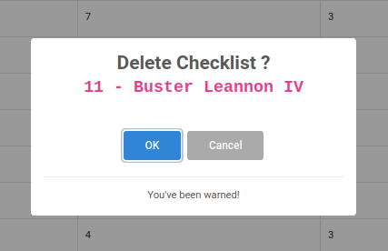

### This project build for FE Test

Consuming laravel API backend at https://checklists.wafvel.com/

#### How To Run :

1. git clone https://github.com/randhipp/cra-checklist.git cra-app 
2. cd cra-app 
3. yarn
4. yarn start

Dev app should be accessible in localhost:3000

#### Live Dev

This project currently live at [http://cra-checklist.wafvel.com:8880](http://cra-checklist.wafvel.com:8880)

#### Credentials

This App protected using Token based Auth ( Laravel Sanctum )
To be able to access Dashboard, Checklists, and Create Checklist, you must login first.

```bash
email    : admin@admin.com    
password : password
```

#### Screenshots





#### License

MIT

#### Credits
This project was bootstrapped with [Create React App](https://github.com/facebook/create-react-app).
